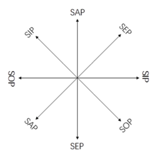

### 第八次 位换和质换

***

“米士特周，我请问你，假若我说‘一切读书的人是有知识的’，我们可不可以因 之而说，‘一切有知识的人是读书的人’?”吴先生一开头就问。

“这......这......这很难说。”周文璞显得很迟疑的样子。

“哦!你怎么没有从前那么爽快了?”

“这是许久以来，听吴先生讲逻辑的结果。”王蕴理笑道。

“这要算是一个不小的进步。说话多用脑筋想想，不一下子冲口而出，总是一种 好的习惯。”吴先生笑着说。

“吴先生今天预备对我们讲什么呢?”王蕴理问。

“我今天预备讲讲几种说话的方式。当然，说话的方式很多，我在这里所谓的说 话的几种方式，不是修辞方式，也不是如何动人的方式，而是严格从逻辑方面着眼 的方式。我们在这里预备进行讨论的说话方式，系从A、E、I和O出发的。因而，我 们的讨论也就限于A、E、I、O四种语句。第一种方式，逻辑传统叫做位换 (conversion);第二种方式叫做质换(oberaion)。

“我们先讨论第一种方式。所谓位换，就是将上述四种语句之一之主位词端换到 宾位去，而将宾位词端换到主位去。这样的更换，不是可以任意为之的，而必须遵 守二个规则:第一，在原来语句中没有普及的词端在换位语句中也不可普及，但 是，这话并未禁止我们将已普及的词端变为不普及的词端。在某种条件之下，我们 可以这样做。第二，不可变更原来语句之形式的性质。这也就是说，原来语句是肯 定的，换位语句仍须为肯定的;原来语句是否定的，换位语句须为否定的。

“各位一看第一条规律，立刻就可以知道我们在上一次所说的A、E、I、O四种语句的词端之普及与否的情形是位换的重要依据。这也就是说，那四种语句的位换， 要以它们的词端是否普及为依据。因此，依据上一次所说的四种语句的词端之普及 与否的情形，我们可以决定那四种语句的换位可能。

“我们先看A吧!我们在上次说过，A的主位词端普及而宾位词端未普及。就以我 刚才所说的‘一切读书的人是有知识的人’为例，这个语句的主位词端‘读书的人’是已 普及的，而宾位词端‘有知识的人’没有普及。根据位换的第一条规律，我们不能换 作‘一切有知识的人是读书的人’。因为，这样一换，在原来语句中没有普及的词端‘有 知识的人’，到了换位语句中变成普及的。这犯了第一条规律。”

“吴先生，这里也许包含‘有知识的人’这个类的范围之大小怎样划定的问题。”周 文璞说:“如果所谓‘知识’不限于书本上的知识，那么‘读书的人’的确是‘有知识的人’之 一部分，因而不可作刚才的位换。可是，如果所谓‘知识’的解释只限于书本的知识， 那么，‘读书的人’就是‘有知识的人’，而且‘有知识的人’也就是‘读书的人’。这样一 来，‘一切读书的人是有知识的人’换成‘一切有知识的人是读书的人’，虽不合第一条 规律，但内容是对的。我们何必因遵守形式规律而牺牲内容呢?”

“你这个问题，问得相当有道理，但可惜不是一个逻辑问题。对于‘知识’的范围 大小之划分，各人有其自由，逻辑也不去规定。但是，请你注意逻辑所研究的，不 是一个一个特殊的语句，而是某一种语句所共同具有的形式。因而，它所说的话， 是对于某一语句之形式所说的话。于是，具有这种形式的一切语句之变换，都须以 这种形式所须遵守的规律为依据。我们常常得注意，逻辑所要保证的是推论之普遍 的效率。既言普遍的效率，当然必须对一切情形有效而无一例外。因此，如果有种 推论方式，有时固然可得出真的结论，但有时则得出假的结论，既然如此，于是它 并非对于一切情形有效，因此，我们必须放弃它......当然，”老教授提高声音:“每一 种科学有一特定范围。如果我们进入某一特定范围，而且明白划定所要对付的题 材，那么也可以试用特定的推论的程序。例如，在数学中，常常可以像你那样推论 的，凡用等号所表示的程序都可如此。你所作的推论，一个语句两头的词端可以互 相对换，没有限制，我们叫做无限位换(unlimited conversion)。在逻辑上，我们 在许多条件之下把一个语句两头的词端之互相对换，加上某些条件之限制，这种位 换，我们叫它限量位换。......但是，我们不要以为这种分别是由于数学的推论与逻辑 相反。无限位换在基本上，如果可以行得通，那么限量位换，自然更可以行得通。 是不是?不过，限量位换行得通的语句多于可行无限位换的语句。所以，逻辑只规定限量位换的规律。上面的规律是普遍地对于具有A形式的一切语句而说的。并非对 于某一具有A形式的语句之特殊内容而说的。这一点必须弄清楚。上面所举第一条规 律说凡在原位语句没有普及的词端在位换语句也不可普及。这一条规律如不遵守， 对于将‘一切读书的人是有知识的人’换成‘一切有知识的人是读书的人’这样的例子， 好像看不出很明显的毛病，可是对于其他A式语句，常常可以产生严重的后果的。再 举个A式语句为例吧!假如我们将‘一切尼姑是女人’换位成‘一切女人是尼姑’，那岂不 糟糕?”

“哈哈!”

“哈哈!”

“如果遵守位换的第一条规律，那么就可保证不出这种笑话，吴先生接着说，“当 然，这种错误是显然易见的。我们知道并非一切女人都是尼姑，可是，这种错误之 所以显然易见，不是依据逻辑的理由，而是依据经验知识。在我们具备某一语句所 表示的经验知识时，我们固然可以特殊地决定它是否可以将在主位的词端和在宾位 的词端对换。可是，在我们未具备某一词句所表示的经验知识时，我们就不能特殊 地决定是否可以将它在主位的词端和在宾位的词端对换。当着我们熟悉尼姑是女人 的一部分，而且不是一切女人都是尼姑时，我们凭着这一经验知识来决定我们不能 将‘一切尼姑是女人’换位成‘一切女人是尼姑’。可是当着我们知道‘凡大朵的蔷薇花是 大叶子的’时，我们是否可以说‘凡大叶子的蔷薇是开大朵的花’，这就须要有园艺上的 专门知识。在这一关卡上，如果我们有了一点逻辑训练，我们就可以不冒冒失失地 从‘凡大朵的蔷薇花是大叶子的’推论‘凡大叶子的蔷薇是开大朵的花’。谨严，一方面 可以减少错误知识之发生;另一方面可为正确知识预留地步。像这一类的问题是非 常多的，如果我们一个不小心，随便换位，得到假知识，往往发觉不出假知识由何 而生。可是，逻辑告诉我们，这一类的语句是A式语句。凡A式语句不可简单地将主 位词端换成宾位词端。如果我们谨守这一条规律，无论我们对于所说的A式语句的内 容有否经验知识，我们一概不简单地将其在主位的词端换位为在宾位的词端，那么 凭着这一逻辑规律的保证，我们就不会触犯上述的错误。

“假如我们要将A式语句换位，那么怎样办呢?”王蕴理问。

“办法很简单，就是当着要将宾位词端换成主位词端时，我们把它的量加以限 制;即是，宾位词端在原来语句中未普及，在换位语句中不让它普及，这样，位换就不会发生毛病。前例‘一切尼姑是女人’可换成‘有些女人是尼姑’。这种位换法，传 统叫做‘限量位换’，亦即conversion‘per accidens’。

“我们在前面说过，就A在主位的词端和宾位的词端是否普及之情形来观察，A是 〇)。而且，我们又说过，不对称。既然如此，不等于)〇。如果等于)〇，则在 原来语句未普及的词端经过换位手续后，变成普及词端〇，这就犯了逻辑之大忌。 但是，我们只说在原来语句中没有普及的词端在换位语句中不可变成普及的;我们 并没有说，在原来语句中普及的词端在换位语句中不可变成未普及的。在一种条件 下，我们可以把在原来语句中普及的词端在换位语句中变成未普及的。依据这条规 律，我们可以得到关于A换位之最简单的手术。即是，”老教授写着:

```
〇) 可换成))
```

“不过，行限量位换，必须词端有存在的意含(existential import)，即词端所 指之类有分子。......”老教授慢慢地说，“可是......这方面的道理，不是此时所需要的， 所以我们提到一下就够了。”

“E式语句怎样换位?”周文璞问。

“E式语句的换位最简单。”吴先生说，“这从符号就可以知道。E式语句的词端底 普及情形是〇〇。既然如此，两端都已普及，毫无分别。既然毫无分别，当然可以 毫无限制地将主位词端换成宾位词端，而且将宾位词端换成主位词端。‘没有独裁者 是讲民主的人’在这个语句中，‘独裁者’之类之一切分子被排斥于‘讲民主的人’之类以 外。同样，‘讲民主的’之类之一切分子被排斥于‘独裁者’之类以外。于是，‘没有独裁 者是讲民主的人’可以换位为‘没有讲民主的人是独裁者’。E的位换可能，从其普及记 号，我们只要一秒钟就可决定。”老教授又写着:

```
〇〇 换成〇〇
```

“I式语句的位换也最简单。这也可以从符号))看出。两端既然同样未普及，当 然可以简单换位。‘有些红颜是薄命的’可以换成‘有些薄命的是红颜’，还是))。所以，我们可以写:

```
)) 换成))
```

“O式语句无法换成。这有二个理由:第一，如果将在主位的词端简单地换成在 宾位的词端，而且将在宾位的词端换成在主位的词端，那么便违反上述位换底第一 条规律。这种情形从符号)〇与〇)并不对称可以一眼看出。‘有些人不是音乐家’如 果换位为‘有些音乐家不是人’，显然是可笑的。‘有些人不是穷小子’换成‘有些穷小子 不是人’也不对。‘有些人不是穷小子’是一真语句，而‘有些穷小子不是人’乃一假语 句。由真语句产生假语句，可见这种推论方式无效。如果由真得假可行，那么整个 逻辑要破产了。第二，如果将O中表示否定的形式词字移到换位后的主位词端，即原 来的宾位词端，那么结果改变了原有语句的形式性质，即由O式语句经过换位后变成 I，这有违第二条规律。‘有些黑鸟不是乌鸦’如果换成‘有些非乌鸦是黑鸟’，显然将原 来的否定语句〇变质为肯定语句I，这有违第二规律。

“但是，”周文璞想了一下，“吴先生，我们从‘有些暴君不是心理正常的人’，换位 成‘有些心理正常的人不是暴君’，系由一真语句得到一个真语句，这岂不表示O还是 可以位换吗?”

“是的，如果仅仅就这一对语句来说，O是可以换位的。但是，这样的简单位 换，并非普遍有效。除了上面所说的例子以外，我可以再列举一对例子。如果‘有些 狗不是猎犬’为真，则其换位语句‘有些猎犬不是狗’显然为假。我在前面说过，逻辑的 推论方式，必须普遍有效。既然O型语句在有些例子之下可以换位，而在有些例子之 下换位会弄出刚才所说的毛病，可见，如果把O看成可以简单位换的语句，这一办法 并不普遍有效。既不普遍有效，那么，在逻辑的范围里，我们不能这样做。......，就 逻辑的理由说，O之不能换位，理由非常简单，即是，如果)〇换成〇)，便是在原 来语句中未普及的词端(，在换位语句中变成普及的词端〇。调一个头，就偷偷由 偏而全，犯了逻辑之大忌。仅仅这一条理由，就足以防止我们对〇实行换位，而用 不着一个一个举出语句来试了。

“我转了这么久，二位嫌太繁吧!其实，位换手续，如果从表示A、E、I、O的普 及之符号方面着眼，真是再简单也没有了。我们现在把上面所说的，用符号表示出来，以作关于位换的讨论之总结。箭头表示推论。”吴先生画着、写着: 

```
〇)→))
conversion "Per accidens" 
〇)→))
〇〇→〇〇
unlimited conversion 
)〇
Conversion impossible，即不可能
```

老教授画完写完，放下铅笔，靠在沙发上休息一会儿，又抽着烟，慢慢吞吞地 说:“关于位换，我们已经讨论完了，我们现在要来讨论质换(obversion)。质换也 是我们常用的一种说话方式;更严格地说，它是一种改变语句之质的方式。质换就 是改变原有语句之形式性质，而得到一个与原有语句相等的语句。详细一点说，质 换就是借改换原有语句的宾位词端的性质以得到与原有语句之意义相等的反面语 句。在质换时，语句的量须保持不变，这是一个要求。

“我们现在试试将A、E、I、O一一加以质换。我们还是照前面的记号法，以A代 表全谓肯定语句，S代表主位词端，p代表宾位词端。我们将A写在S与p之间。于是， A式语句可写成SAp。以代表‘非p’，于是，SAp换质时可写成SE;反过来也是一样， SE换质是可以写成SAp,二者的质换是对称的。例如，‘所有的动物是有机体’可以换质 成‘没有动物是非有机体’。同样，‘没有动物是非有机体’可以换成‘所有的动物是有机 体’。‘凡英雄皆当配美人’可换质成‘没有英雄不当配美人的’。

“E式语句可以换质成与之相等的A式语句。‘没有魔鬼是天使’可以换质为‘一切魔 鬼是非天使’。倒转来也是一样，‘一切魔鬼是非天使’可以换质成‘没有魔鬼是天使’。 普遍地说，SEp与SA可以互相质换。

“I式语句可以换质成与之相等的O式语句。‘有些蚂蚁是好斗的’可以换质为‘有些 蚂蚁不是非好斗的’，倒转来也是一样。普遍地说:SIp与SO二者可以互相质换。

“O式语句可以换质成与之相等的I语句。‘有些学生不是运动员’，可以换质成‘有 些学生是非运动员’，倒过来说也是一样。普遍地说:S0p与SI二者可以互相质换。

“从以上所说的，我们可以知道，凡属肯定语句的质换，是双重否定;凡属否定 语句的质换是将系词上的否定记录移置到在宾位的词端上去。双重否定等于一个肯 定。例如，在代数学中，

```
-(-a)=a
```

吴先生接着说:“所以原来语句经换质后与被换语句相等。” “吴先生，在修辞学上，双重否定并不等于一个肯定，而是加强了的肯定语气。”周文璞说。

“不错，”吴先生答道可是，那是一个心理问题，与逻辑的语句形式是否相等无 关。......复次，我们知道，四种语句换质后，与原有语句是相等的。既然相等，所以 是对称的，这种情形，我们可以画一图表示表示。”老教授在纸上画者:

<div align="center"></div>

“双箭头表示对称。我们看了这个图表，质换的情形便可一目了然。”吴先生说。

“除了我们在以上所说的以外，一个语句之位换和质换可以轮转举行，这样仍可 得到不同形式的语句。如果我们知道了轮转举行位换与质换之方式，那么我们就可 以对付许多问题。现在，我们可以择其重要的谈一谈。

“第一种问题乃确定一组语句是否相等。假定有这两个语句: 

```
1没有非英雄是可配美人的
2一切可配美人的是英雄
```

“我们现在要决定1和2两个语句是否相等。为了作此决定，我们先把这两个语 句的形式列出，然后进而换质与换位，一直到得到一些形式为止。我们再看这些形 式，就可以知道二者是否相等。我们以‘h’表示英雄，以‘e’表示‘可配美人者’，三横表 示相等关系。”

```
1’没有非h是e≡没有e是非h 
没有e是非h≡一切e是h 
2’一切e是h≡没有e是非h 
没有e是非h≡没有非h是e 
1’等于2’
所以1等于2
```

“依据相似的程术，我们再决定下列一双语句是否相等。

```
3有些医生是不可信赖的 
4有些可信赖的人是非一医生
```

“照样我们把3、4的形式列出:在此，我们用‘d’代表医生;用‘t’代表可信赖 者。”

```
3’有些d是非t≡有些d不是t 4’有些t是非d≡有些t不是d
```

“这两个等式的右边，显然彼此皆为潜越位换，即不合法的位换。由此可知，3 不等于4。关于3与4之不相等，借图解最易看出。”老教授不厌其烦地画着:

```
3有些d是非t
```

<div align="center"></div>

```
4有些t是非d
```

<div align="center"></div>

“另一种问题是，如果我们知道了这些程术，那么我们就可以讨论，一个包含类 的语句会有些什么结论。假若有‘有些财阀不是有远见的’，那么，我们能作些什么推 论?兹以‘c’表示财阀，‘f’表示远见者。我们可以列出形式如下:

```
有些c不是f≡有些c是非f 
有些c是非f≡有些非f是c 
有些非f是c≡有些非f不是非c
```

“我们在此所能推论的是，有些非具远见的人不是非财阀。”

“......当然，在逻辑传统中，位换与质换轮转配合起来的花样还有许多。不过， 其中有些似乎无关宏旨，所以不必注意。同时，位换与质换之轮转运用，在基本 上，无非是位换与质换，并没有新的逻辑因素。因此，关于二者的轮转程术，看看 我们在这里的例示，也就可以举一反三，无须辞费了。”