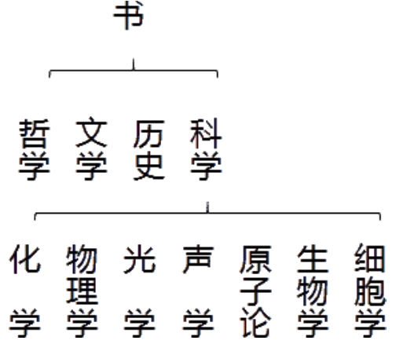

### 第十六次 分类与归类

***

“我们上一次谈的是语意界说。接着语意界说，我们所应须讨论的是分类与归 类。谈到这里，我们已经接近逻辑的应用之边沿了。

“科学，正如人的一切其他知识一样，是从感觉经验开始的。但是我们的感觉经 验如此分歧，繁复。我们要把纷繁的事物加以处理，必须从事分类和归类。可是， 时间愈过愈久，我们的活动愈不受实际需要所限制，而从无关利害的知识活动方面 发展。这种发展，与从量地皮之实用术进步到超乎实用的几何一样的。这样一来， 我们对于事物之分类与归类，愈来愈客观，愈来愈以事物的特征为标准，而不以人 的需要、兴趣为标准。到了这一阶段，分类和归类都应用着逻辑概念和逻辑方法。

“我们现在要先谈分类(classification)。我们将一个类分为次类(subclass)，这种程序，叫做分类。分类在我们日常生活里时时用到。街头卖香烟的摊 贩知道将牌子相同的烟摆在一起;图书编目便是分类的实际应用;中国人编家谱也 应用分类;生物学家将生物分作界、门、纲、目、科......。生物学中的分类学是一个 重要的学科，不过这些情形是分类的应用，而不是分类的原理原则。如果只注意分 类的应用而不注意分类的原理原则，遇到被分的对象太复杂时，分类就难免陷于混 乱或错误。逻辑不研究分类的应用，而只研究分类的原理原则。

“图书馆里的书，往往被分做哲学、文学、历史和科学等等。而科学之下，又分 做数学、物理学、化学等等。物理学之下，又分做光学、声学、电学、力学等等。 这种分类，用图解表示出来，容易清楚。”吴先生在小黑板上画着:

<div align="center"></div>

“在这个图解中，‘书’是总类，算最高层次;‘哲学’、‘文学’、‘科学’等算第二层 次;‘科学’之下的数学、物理学等，算是第三层次;这样一直下去。显然得很，每一 层次是秩序井然，有条不紊的。

“不过我刚才所列举的，是一个特例，即分类应用于图书编目之一特例。我们刚 才说过，逻辑不研究这类特例，而只研究分类的普遍原理原则，这普遍原理原则是 可应用于一切分类特例的原理原则。既然如此，分类的构架(Scheme)是抽离 (abstract)的。我现在再进一步地将分类的普遍构架用图解表示出来。

<div align="center"></div>

“X表示最高类，X之下分作XI和-XI二类。‘-’意即‘非(non)’。-XI是XI之补类 (complementary class)。‘白鹤’是一类，‘非白鹤’是白鹤之补类。XI类之下又分作 XIa和-XIa二类。这类一直下去，以至于无可再分或不必再分之类。X自成一层次。此 外，每一类及其补类构成一个层次，这种分类是二分法(Dichotomy)。二分法曾被 当作是分类中最基本的程序，其他分类是二分法之复杂化。”

“吴先生，分类有规律可循吗?”王蕴理问。

“有的。从图解中我们可以知道，分类必须分别层次。首先从最高层次开始，其 次到第二层次，再次到第三层次，一直下去。我们必须明白，分类之起点与终点都 是相对的。在分类时，我们需要从被分对象的哪一层次开始就从哪一层次开始，我 们需要止于哪一层次就止于哪一层次。我们所要开始分类的那一层次就是我们分类 系统中最高的层次，我们所要停止的那一层次就是我们分类系统中最低的层次。就 前例来说，如果我们藏书室中只有科学书而没有别的书，我们分类只需从科学开 始，因而我们的分类之最高层次就是科学书。如果我们收藏的科学书分门别类很 多，很专门，那么我们分类可以一直分下去，以至穷尽我们所收藏的范围最窄的那 一层次。否则，如果我们所收藏的科学书，不过普通的数学、物理学、化学等等而 已，那么我们分到这里为止就够了。

“虽然分类的起点与终点是不同的;可是，在分类之中，各类的层次必须清楚， 而不相混。这一原则是绝对必须遵守的。即是，同一层次的事物，在分类中必须与 同一层次的事物并列，否则，便是分类紊乱。紊乱的分类，是不适用的。假若把书 像这样分类的话。”

<div align="center"></div>

“那么这个分类是层次紊乱的。因为，光学、声学等等物理学中的部门，应该在 物理学底下，而不当与物理学，平列地放在同一层次之上;同样，把细胞学与生物 学并列，也是层次混乱。这样的分类，有时是由于知识不够，有时也是由于头脑欠 清楚。

“所分之类必须互不兼容，如果动物之类不包含植物之类，而且植物之类不包含动物之类，那么我们将生物分作动物与植物，这样的分类所分出之类才是互不相容 的。所分之类互不相容，分类之目的才达到。如果不然，分出之类不是互不兼容而 是兼容的，那么后果可能很严重。在医院中，外用药和内服药如果摆混了，说不定 会毒死人的。如果我们将‘物’分作‘生物’与‘动物’，结果等于没有分类，因为X是生物 时，也可能是动物。在刚才所列的图式中，XI与-XI是互不兼容的，这是一种标准情 形。”

“依此，我们可以进一步推知，每次分类，必须依照一个原则进行，即是必须采 取一个单独的分类标准。例如，我们要对人行分类，可依其肤色来分;如果高兴的 话，也不妨依其高矮来分。但是，无论如何，每行分一次分类，在同一层次之上， 只可采取一个标准，如果采取二个以上的标准，那么便形成跨越分类(cross division)。跨越分类，为科学研究工作上之大忌。我们对人行分类时，如果既依肤 色分类，又同时依高矮分类，那么便分出‘长白种人’、‘矮白种人’、‘长黑种人’、‘矮黑种人’等等。这真妙不可言!” 

“哈哈!”周文璞大笑起来。 

“这真弄得很乱。”王蕴理说。

“分类所设的标准之数目必须足以穷尽所分对象，如果不能穷尽，那么便会有遗 漏。例如，我们作图书馆编目员，馆里的哲学书有西洋、印度和中国的哲学，如果 我只把这些书分作二类，那么第三类一定无法编进，这样，人家要找第三类的书就 很不方便。在生物学中，如果发现新种，原有的分类标准不足以涵盖它，于是需要 创一新格来涵盖它，这就是为了满足分类必须穷尽之要求。”

“为着进一步了解分类在科学上的应用，我们不妨再作说明。假定有十个单独的 例子，他们可以选来作比较的性质有五种。兹以大楷A、B、C、D、E各别地表示这 五种性质;以小楷a、b、c、d、e各别地表示没有这五种性质。我们先以A作为重要 的性质据之以分类，其余的性质是这一分类中所表示的性质:”

```
CI1st CI2nd 
ABCDE aBCDE 
ABcde aBcde 
AbCDE abcDE 
AbcDe abcDe 
AbCDe abCDe
```

“我们观察这个图表，可知第一类中有A，第二类中无A。在这两类之中，除了第 一类有A，第二类无A以外，再没有其他不同之点。这样看来，如果我们认为A是重 要的性质，拿这个性质作为分类的标准，那么不能表示出其他同时俱存的性质，所 以这个分类没有用。”

“如果我们再以C为重要的性质作为分类标准，那么其余性质可以在这个图表中 看出。”老教授又一个字一个字地写着:

```
CI1st CI2nd 
ABCdE ABcde 
aBCdE aBcDe 
AbCDE ABcDe 
abCDE abcDe 
aBCDe abcde
```

“请二位注意，在这个表中，我们可以看出:凡有C的例子都有E，凡无C的例子 都无E。C与E是同存的性质，而且都是积极的。除此以外，A、B、D或有或无，可都 是偶然的性质。偶然的性质，与分类的进行不相干，所以，第二种分类比第一种有 用。例如，如果动物学家以颜色与形体作动物分类的标准，那么难免把鲸与其他的 鱼放在一类去分;把蝙蝠与燕都视作鸟类。这样一来，一定笑料百出。因为，颜色 与形体，在决定动物之类别上，为全不相干的因素，这样分类，势必弄得乱七八 糟。可是，如果动物学家以脊椎为重要的因素，分动物为二大类:一为有脊椎类， 一为无脊椎类。这么一来，便可表出其他同存的因素。例如，凡有脊椎者皆有齿或 喙，凡无脊椎者就没有;凡有脊椎者都有神经总管在背脊上，都有可涨缩的循环机 关在腹下;凡无脊椎的动物神经和循环系的组织都不同。至于肉食、素食、步行、 游行、飞行、颜色、大小，都不相干。

“......再举一个例子吧!假若我们要选举国会议员。选举时，我们是有意无意在 思想中把人作了一个选择。有选择，就有选择标准，这就是在进行一种分类作用。 但是，分类的标准是否高明，却有天壤之别。如果我们以‘说话漂亮’为选择标准，那 么诚实、公正、无私等等国会议员所须具备的品质，不见得会随说话漂亮而有。因 为，不诚实、不公正、自私等等坏的性质，也可随说话漂亮而来。由此可见，‘说话 漂亮’并非在人中进行分类以选择国会议员的适当标准。可是，如果我们以‘公正’为选 择标准，那么，我们所要求于被选者的其他性质，如诚实、无私等等，也可以相随 而来;而诈欺、自私等等恶劣性质不会随‘公正’而来，所以，我们拿‘公正’作选举国 会议员的标准，比拿‘说话漂亮’要可靠得多。

“与分类刚好相反的便是归类。我们依事物的性质或其他共同点而把他们集成类，这种程序，叫做归类(classification)。

“一般人所作的归类，系依据个人的需要、利害、兴趣，甚至于注意力而定。农 人把农作物常常分得颇为详细，例如，蔬菜、谷物、水果等等，可是，对于
花花卉 则颇为忽视。园艺家对于花卉的归类详细，而对于农作物之类别则不甚注意。这种 归类原则，虽有实用价值，或有心理价值;但是，却没有科学价值。当我们不依科 学的眼光来归类时，常常把不重要的因素当作重要的因素而行归类，结果这样的归 类，对于知识毫无帮助。一般人对于动植物归类时，常以其颜色与形体之大小作归 类标准。过去以鲸为鱼，中国‘鲸’字就表示此意。因为过去以为居在水中者为鱼，实 则鲸为哺乳类，与鱼可谓风马牛不相及。过去的人以煤为无机物，因煤自矿中掘 得，其实，煤是由植物化石化(fossilize)而成的。有人以为海白头翁(seaanemone)是一种植物，其实他是动物。呼吸、燃烧、生锈，一般人以为各是不同 的现象，但科学昌明以后，知道这都是由于氧化作用所致，因而都是一类的事物。 这凭常识是不可想象的。

“归类是在杂多之中见共同之点。我们认识一个类，就是在许多单独的事例中认 识基本相同的因素。归类方法，乃科学首先采用的方法。许多科学，在一个长久时 期停留于一个归类的阶段，植物学、动物学尤其如此。

“假若我们看见一些有共同性质的个体，例如人吧，那么我们可以根据他们所有 共同性质把他们组成一个类，叫做人类。我们又发现一些东西，例如马，它们彼此 之间相同的程度大于它们与人类之间的共同程度，于是我们把它们又组成一个类， 名之曰马类。后来我们一看人类与马类固然不同，可是两者之间的共同点多于两者 与树和草之间的共同点。例如，两者都能行动，这是树和草所没有的特点，于是把 两者又归为一个较大的类，名之曰动物。同样的，我们知道植物共同具有的其他特 点，例如制造叶绿素、直接从土壤和大气中取得食物等等，而且这些特点是动物所 没有的，因此又把它们归为一个较大的类，叫做植物。......一直像这样归类下去，可 以归到最大类。《荀子·正名篇》中也有与此相似的意思:‘......推而共之，共则有 共，至于无共然后止。’

“我现在画一个图解，来表示归类的结构和程序或活动，请各位注意!”老教授又 画着:

<div align="center"></div>

“XA1......表示被归的对象。虚箭头......→表示归类的历程或活动或作用。我们为什么要用虚箭头来表示归类的历程或活动，而不用实箭头——→来表示呢?因为我 们在此所注重的是归类之‘动’的方面，而虚箭头所表征的比实箭头所表征的更富于动 的意象，所以我们用虚箭头而不用实箭头。”

“从这个图解中，我们可以知道归类也是有层次的，不过程序和分类相反。归类 的程序从最小的类起始，一层一层地归到最大类，每归一次则类愈大一级。

“至于归类的时候所必须遵守的原则，和分类的时候所必须遵守的原则相似。诸位把后者稍稍变通一下就成了，用不着我赘述。”

“天太晚了，我们下次再来吧。”周文璞提议。 “好吧!”吴先生看看表:“啊!已经十一点了。”